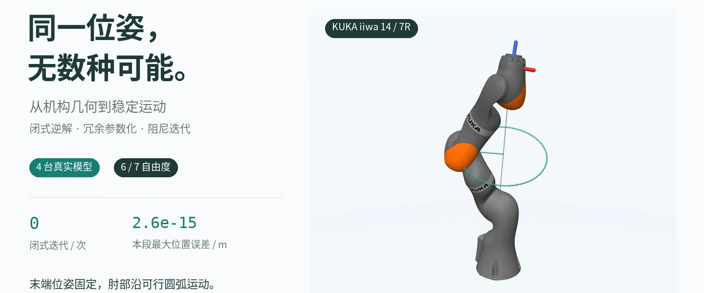

# 机械臂逆运动学：从机构结构到连续运动

同一个末端位姿，可以对应多种手臂构型。这个项目围绕 **UR5e、Lite 6、KUKA iiwa 14 和 Franka Panda**，实现结构识别、闭式求解、冗余参数化与阻尼数值求解，并在 MuJoCo 中复核位置误差、姿态误差和关节限位。



**[阅读完整作品介绍 →](docs/homepage/inverse-kinematics.md)** · [复现与主页发布](docs/REPRODUCING.md) · [实验数据](docs/homepage/public/assets/data/inverse-kinematics/portfolio_metrics.json)

**固定末端多解**：[四联动画](docs/homepage/public/assets/videos/inverse-kinematics/pose_quad.mp4) · [动态验收数据](docs/homepage/public/assets/data/inverse-kinematics/pose_metrics.json) · [静态构型图集](docs/homepage/public/assets/img/projects/inverse-kinematics/solutions_quad.webp)。UR5e、Lite 6 直接切换离散闭式候选；iiwa 改变臂型角，Panda 按指定 `q7` 做 DLS 数值延拓。

**整圈可行性**：[iiwa 诊断图](docs/homepage/public/assets/img/projects/inverse-kinematics/swivel_feasibility.webp) · [解释动画](docs/homepage/public/assets/videos/inverse-kinematics/swivel_iiwa14.mp4) · [扫描数据](docs/homepage/public/assets/data/inverse-kinematics/swivel_metrics.json)。0.25° 网格上逐角有解，本次邻接图中没有贯穿整圈的候选连接链；本目标的肘圆投影围住肩轴，而 J1 仅有约 340° 行程。结论限定于当前目标、关节限位和扫描设置。

**运动演示**：[四台直线逐点跟踪](docs/homepage/public/assets/videos/inverse-kinematics/path_line_quad.mp4) · [四台末端圆周运动](docs/homepage/public/assets/videos/inverse-kinematics/path_circle_quad.mp4) · [轨迹数据](docs/homepage/public/assets/data/inverse-kinematics/path_metrics.json)。明亮背景下画出目标路径，固定末端姿态。

项目展示三件事：根据关节轴结构选择求解方法；区分六轴的离散分支与七轴的连续冗余解集；在笛卡尔轨迹上检查误差、关节变化与限位。展示图和数字由同一条实验管线生成。

## 快速开始

需要 Python 3.10+、MuJoCo，以及 [MuJoCo Menagerie](https://github.com/google-deepmind/mujoco_menagerie) 中四台机器人的模型。固定依赖、模型 commit、字体与 ffmpeg 的安装要求见 [复现说明](docs/REPRODUCING.md)。准备环境后，在仓库根目录运行：

```bash
python -m scripts.showcase.build  # 计算数据、渲染当前展示并导出主页包
python -m pytest -q
```

已有发布素材只需运行 `python -m scripts.showcase.export_homepage` 即可重新打包，无需重渲。复制 Markdown、素材或 zip 到 Astro 的方法，以及 Linux 离屏渲染环境说明，统一见 [复现与主页发布](docs/REPRODUCING.md)。

下面用一个可达目标跑通数值 IK：

```python
import numpy as np
from ik import load_robot, solve_numerical

arm = load_robot("ur5e")
q_target = 0.5 * (arm.joint_low + arm.joint_high)
q_target += np.array([0.2, -0.4, 0.3, -0.2, 0.4, 0.1])
target = arm.fk(q_target)
q0 = q_target + np.array([0.05, -0.05, 0.04, 0.03, -0.04, 0.02])

result = solve_numerical(arm, target, q0, method="dls")
print(result.success, result.pos_err, result.rot_err)  # m、rad
```

## 求解方法与代码职责

**Pieper 准则包含两种充分条件**：6R 串联机构的三个连续关节轴共点，或三个连续关节轴相互平行。它们充分但非必要。UR5e 展示平行轴路线，Lite 6 的 J4–J6 已覆盖共点球腕路线；iiwa 为 7R，仍需处理冗余参数。

- **UR5e / Lite 6**：利用平行轴或球腕结构构造闭式分支，返回前检查正运动学残差、关节限位并去重。实现见 [ik/closedform.py](ik/closedform.py)。
- **iiwa 14**：用臂型角参数化 S-R-S 冗余解集，按角度计算并筛选合法构型。实现见 [ik/srs.py](ik/srs.py)。
- **Panda**：通过腕心与臂型角采样构造几何初值，再用 DLS 修正。实现见 [ik/analytic.py](ik/analytic.py)。
- **通用数值与冗余求解**：雅可比转置、伪逆、自适应 DLS，以及限位规避、姿态偏好和可操作度次级目标。实现见 [ik/numerical.py](ik/numerical.py) 与 [ik/redundancy.py](ik/redundancy.py)。
- **模型与验证**：[ik/robot.py](ik/robot.py) 提供统一接口，[ik/structure.py](ik/structure.py) 检查关节轴关系；Panda 的 MDH 正运动学与 MuJoCo 互校，雅可比通过有限差分检查。
- **展示管线**：[scripts/showcase/](scripts/showcase/) 重新计算目标、误差、轨迹与动画，把实验记录写入 JSON，再渲染插图。

## 目录与生成物

- [ik/](ik/)：求解器、模型与运动学接口；[tests/](tests/)：数值正确性与展示数据验证。
- [scripts/](scripts/)：数值、解析和冗余求解 demo；[scripts/showcase/](scripts/showcase/)：当前实验、渲染与导出管线。
- [docs/homepage/inverse-kinematics.md](docs/homepage/inverse-kinematics.md)：唯一作品正文，适配 Astro 的项目页面。
- [docs/REPRODUCING.md](docs/REPRODUCING.md)：环境、完整复现、素材打包与主页复制方法；[docs/ik_survey.md](docs/ik_survey.md)：数学推导、参考资料与历史实验。
- [docs/homepage/public/](docs/homepage/public/)：页面实际引用的 WebP、MP4 与 JSON，随仓库保留。
- `build/showcase/`：可重新生成的 PNG、MP4 与中间数据；`build/ik-homepage.zip`：本地分发包。两者均不纳入版本控制。

发布到个人主页时使用 Markdown 与 `public/` 资源，或解压本地生成的 zip；渲染、打包都不会自动修改或部署个人站点。

## 技术边界

Panda 的非球腕使这里采用的 S-R-S 位置／姿态解耦不再精确；其他几何解析方法可见 [He 与 Liu（2021）的 Panda IK 实现](https://github.com/ffall007/franka_analytical_ik)，以 `q7` 为冗余参数求解。Panda 和 iiwa 在正则位姿下都存在一维冗余解集，程序返回的是有限采样；`max_solutions=8` 是本项目 Panda 接口的返回上限。

阻尼下的 `I − J#J` 是近似零空间投影，次级步还要经过主任务误差验收。`portfolio_metrics.json` 的数据来自四个选定目标和四条可达短路径；新增的固定姿态直线与末端圆周演示单独记录在 `path_metrics.json`。轨迹按离散路径点验证，尚未包含碰撞检测、时间参数化、动力学或实机执行。

[方法研究笔记](docs/ik_survey.md) 保留早期推导、参考文献与历史实验，不作为当前版本的验收数据。当前展示对应 `docs/homepage/public/assets/data/inverse-kinematics/` 下的五份 JSON。构建产出的 JSON 合计记录各阶段的源码与输入溯源，`portfolio_metrics.json` 另记录模型 XML 哈希和依赖版本；复现后应核对数值与正文摘要，时间戳、耗时、绝对路径和渲染文件字节不要求完全相同。
