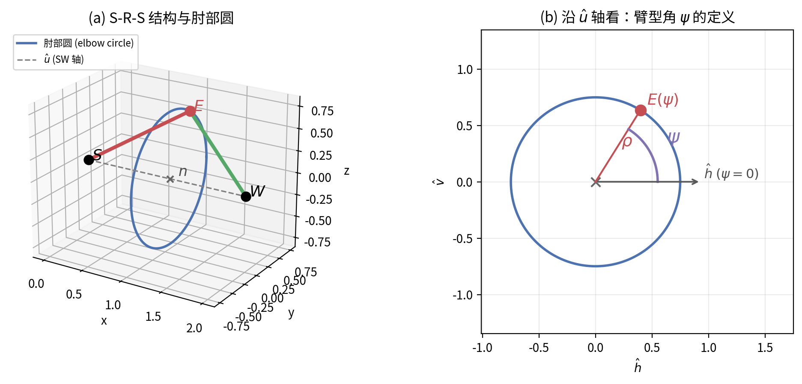
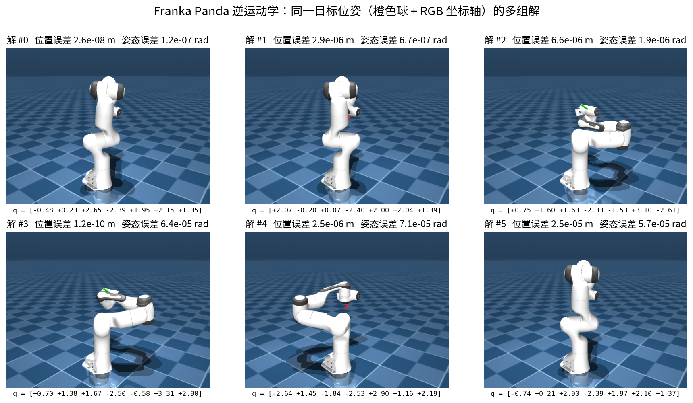
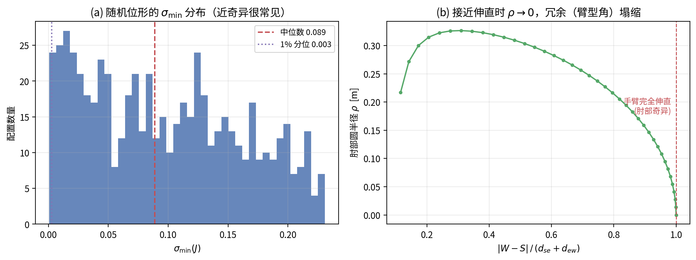
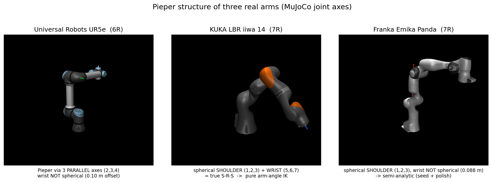
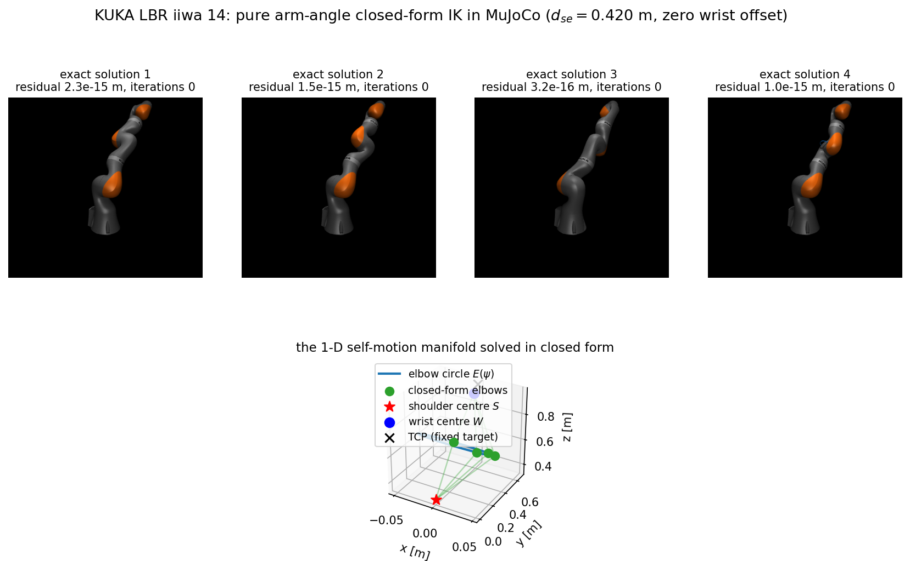

# 机械臂逆运动学方法综述与对比

> **三类主流解法的原理、适用条件与工程权衡** —— 以 7-DOF Franka Panda 为实验平台的实现
>
> 关键词：Pieper 准则 · 球形腕解耦 · 冗余机械臂 · 臂型角 / swivel angle · 雅可比数值迭代 · 零空间

> **历史研究笔记，不作为当前版本验收数据。** 本文保留早期推导、参考文献和实验记录；2026-10-06 已修正解集完整性、Panda 闭式解、奇异性和复现范围等表述。下文历史成功率、耗时与样本统计未在本次重新测量，不能推广为工作空间保证。当前作品与实验设置见 [主页展示](homepage/inverse-kinematics.md)，当前发布数据见 [portfolio_metrics.json](homepage/public/assets/data/inverse-kinematics/portfolio_metrics.json) 等五份 JSON。文中旧目录、脚本命令和实现状态按当时版本保留。

---

## 摘要

逆运动学（Inverse Kinematics, IK）要回答一个看似简单的问题：*要让机械臂末端到达指定位置和姿态，各关节该转到多少度？*
它的困难在于映射是**非线性、多解、且无通用闭式解**的。工程上主要存在三条技术路线：

| 路线 | 核心思想 | 代表结构 |
|---|---|---|
| **① 解析闭式解** | 利用机构几何特征（Pieper 准则）把 6-DOF 问题**解耦**成可解析求解的子问题 | 球形腕 6R 工业臂 |
| **② 冗余臂型角解** | 用**臂型角 ψ** 显式参数化 7-DOF 冗余臂的 1 维自运动，再逐关节闭式求解 | S-R-S 仿人臂 |
| **③ 数值解** | 对误差做**线性化迭代**，用雅可比（伪逆 / 阻尼最小二乘）逐步逼近 | 任意结构 |

本文给出三者的数学原理、解的数量与分支、精度/速度/鲁棒性对比，并用**具体算例**说明多解与冗余自运动，最后专门分析**奇异与近奇异**处的行为（含实测数据），以实测的 Franka Panda 结构说明**当机器人不满足理想假设时如何组合使用**。

> **主要内容**：三类方法的原理（§2–§4）→ 横向对比与选型（§5）→ Franka Panda 实测与具体算例（§6，含 §6.5 算例、§6.6 奇异分析）。

---

## 1. 问题定义与难点

给定末端目标位姿 $T_d = \begin{bmatrix} R_d & p_d \\ 0 & 1\end{bmatrix} \in SE(3)$，求关节角 $q \in \mathbb{R}^n$（关节限位 $q_{min} \le q \le q_{max}$）使得

$$FK(q) = T_d$$

难点来源：

- **非线性**：方程含 $\sin/\cos$ 的乘积，无一般解析反函数；
- **多解 / 无解**：可达位姿通常对应多组 $q$（肘上/下、肩前/后、腕翻转），不可达位姿则无解；
- **冗余**：当 $n > 6$ 时自由度多于任务，解集是一个**连续流形**，需要额外准则（如臂型角、最小范数、可操作度）挑一个；
- **奇异**：某些位形下雅可比降秩，解对末端方向不敏感，数值法病态。

三条路线本质上是在"**能不能解耦**"和"**能不能用几何换速度**"上做不同取舍。

---

## 2. 路线一：解析闭式解与 Pieper 准则

### 2.1 Pieper 准则（1968）

> **若一个 6-DOF 机械臂满足以下任一条件，则其逆运动学存在闭式解：**
> 1. **三个相邻关节轴交于一点**（典型：球形腕）；或
> 2. **三个相邻关节轴相互平行**。

Pieper 条件是闭式可解的充分条件，不是必要条件。对于后三轴汇交的球形腕，腕心位置由前三个关节决定，剩余姿态可由腕部求解；三轴汇交发生在其他位置时，需要对应的结构推导，不能直接套用这一解耦。

### 2.2 球形腕解耦（经典 6R）

设关节 4、5、6 轴交于腕心 $p_w$。末端法兰沿 $z_6$ 相对腕心有一段偏移 $d_6$：

$$p_w = p_d - d_6 \, R_d \hat z$$

**位置子问题**：$p_w$ 仅由 $q_1,q_2,q_3$ 决定。对多数结构可写出 $q_1$（由 $p_w$ 的水平分量），再在三角平面内用余弦定理求 $q_2,q_3$：

$$\cos q_3 = \frac{\lVert p_w\rVert^2 - a_2^2 - a_3^2}{2 a_2 a_3}$$

其中 $a_2,a_3$ 为大臂/小臂长度。$q_3$ 取 $\pm$ 对应**肘上 / 肘下**两支；$q_1$ 取 $\pm$ 对应**肩前 / 肩后**。

**姿态子问题**：先算腕部相对基座的姿态

$$R_3^6 = R_0^3(q_1,q_2,q_3)^{\top} R_d$$

对球形腕，$R_3^6$ 就是 $q_4,q_5,q_6$ 的 ZYZ 型欧拉角，直接反解，得到**腕翻转**两支。

**本类常见结构的分支数**：肩 2 × 肘 2 × 腕 2，可有最多 8 个离散分支，再按关节限位筛选。这不是所有 6R 机构的统一上限；奇异位姿需单独讨论，本项目尚未实现碰撞筛选。

### 2.3 严格基础：Paden–Kahan 子问题

工程上常用的"余弦定理凑"其实可被**李群上的 Paden–Kahan 子问题**统一：

| 子问题 | 描述 |
|---|---|
| Subproblem 1 | 绕**单轴**旋转，把一点转到另一点 |
| Subproblem 2 | 绕**两轴**依次旋转，把一点转到另一点 |
| Subproblem 3 | 旋转使某点到某点**距离**为目标值 |

这些子问题是几何 IK 分解的常用工具；具体机构可能需要额外子问题、代数求根或退化处理。几何解释有助于检查象限和分支，但不能自动保证任意结构的数值稳定性。

### 2.4 优点与局限

- ✅ **计算直接**：结构专用的低层实现可达到微秒级；本项目 Python 接口的速度需按实际返回工作量测量；
- ✅ **分支显式**：针对已推导的机构可枚举分支，完整性还需处理退化情形并验证；
- ❌ **结构绑定**：球形腕公式不能直接用于非球形腕；其他结构仍可能有不同的闭式解；
- ❌ **冗余需额外参数**：对 $n>6$ 通常需先指定冗余参数，再计算相应解族。

---

## 3. 路线二：冗余机械臂与臂型角（Swivel Angle）参数化

### 3.1 冗余与自运动流形

对 $n=7$、任务为 6-DOF 位姿的机械臂，在雅可比满行秩的正则构型附近，零空间维数 $n-6 = 1$，固定末端位姿的局部解集通常是一维自运动流形。它可以有多个连通分量，关节限位也会裁去部分区间：

$$\mathcal{M} = \{\, q \in \mathbb{R}^7 : FK(q) = T_d \,\}$$

要得到确定解，必须引入**一个标量参数**去遍历这条曲线。最常用的参数就是**臂型角 $\psi$**（又称 swivel angle / arm angle）。

### 3.2 S-R-S 仿人臂结构

最容易参数化的冗余结构是 **S-R-S**：球形肩（shoulder, 3 轴汇交于 $S$）+ 单转动肘（revolute, $E$）+ 球形腕（wrist, 3 轴汇交于 $W$），即 7-DOF 仿人臂（如 Baxter、Panda 的"理想版"、很多人形臂）。

固定末端位姿后腕心 $W$ 已知（球形腕可解耦），而**上臂长 $d_{se}$ 与下臂长 $d_{ew}$ 恒定**，于是肘心 $E$ 只能落在两球面的交集上——一个圆。

### 3.3 肘部圆（Elbow Circle）

令 $L = \lVert W - S\rVert$，$\hat u = \dfrac{W - S}{L}$。由 $S$、$E$、$W$ 构成的三角形中：

$$\cos\alpha = \frac{d_{se}^2 + L^2 - d_{ew}^2}{2\,d_{se}L}$$

肘心 $E$ 绕 $\hat u$ 走一个半径为 $\rho$、圆心为 $n$ 的圆：

$$n = S + d_{se}\cos\alpha\,\hat u, \qquad \rho = d_{se}\sin\alpha$$

- **肘点几何条件**：$|d_{se}-d_{ew}|\le L\le d_{se}+d_{ew}$；等号对应退化圆，关节限位与目标姿态仍可能排除候选；
- **端点**：$L = d_{se}+d_{ew}$ 时 $\rho=0$，臂完全伸直——**奇异位形**。

### 3.4 臂型角的定义

在垂直于 $\hat u$ 的平面内取一个**参考方向** $\hat h$（例如让过 $S$ 的臂平面平行于基座 $z$ 轴），臂型角定义为肘心相对该参考绕 $\hat u$ 的转角：

$$\psi = \operatorname{atan2}\!\big((\hat v \cdot (E - n)),\; (\hat h \cdot (E - n))\big), \qquad \hat v = \hat u \times \hat h$$

给定 $\psi$ 后肘心唯一确定：

$$E(\psi) = n + \rho\,(\cos\psi\,\hat h + \sin\psi\,\hat v)$$



*(a) 肘心 $E$ 只能落在以 $n$ 为圆心、$\rho$ 为半径、垂直于 $\hat u$ 的圆上；(b) 沿 $\hat u$ 轴看，臂型角 $\psi$ 是臂平面相对参考方向 $\hat h$ 的转角。*

### 3.5 给定 $\psi$ 的逐关节闭式求解

1. **肩部 $q_1,q_2,q_3$**：由上臂方向 $S \to E$ 在球形肩坐标系中的方向余弦直接反解。球形肩使得这一步是"把向量转过去"的方向问题，有解析表达（一般 2 支：肩左 / 肩右）。
2. **肘部 $q_4$**：由三角形内角，$q_4$ 是 $S\to E$ 与 $E\to W$ 在臂平面内的夹角余角；
   $$q_4 = \pi - \angle(SE, EW)$$
3. **腕部 $q_5,q_6,q_7$**：球形腕 ⇒ $R_4^7 = R_0^4(q_1..q_4)^{\top} R_d$，再做一次欧拉角反解（腕翻转 2 支）。

**给定 $\psi$ 的候选分支**：本类 S-R-S 推导组合肩、肘、腕的分支，通常最多得到 8 个候选。让 $\psi$ 连续变化可描述解族；有限网格采样与返回数量上限不会返回完整连续解集，限位和奇异情形仍需处理。

### 3.6 臂型角的价值

- **显式利用冗余**：$\psi$ 是自由参数，**可以用于避障、避关节限位、最大化可操作度**——只需求解一个 1 维优化问题；
- **可接关节限位**：文献给出对每个关节限位在 $\psi$ 轴上求**可行区间**的闭式方法（Shimizu 2008），能直接给出满足限位的 $\psi$ 范围；
- **速度快**：给定 $\psi$ 后仍是闭式，遍历 $\psi$ 只需重复微小计算。

### 3.7 局限：非球形腕

上述 S-R-S 解耦建立在腕部三轴汇交之上。非球形腕需要在推导中处理轴线偏移；单纯的工具偏移并不一定破坏球形腕结构。本项目对 Panda 选择几何种子与 DLS 抛光（见 §6），但非球形腕不能推出没有闭式解。He 与 Liu 已给出以 $q_7$ 为冗余参数的 Panda 解析几何解（参考文献 9）。

---

## 4. 路线三：数值解（雅可比迭代）

### 4.1 误差定义

定义 6 维任务误差（位置 + 姿态）：

$$e(q) = \begin{bmatrix} p_d - p(q) \\ \log\!\big(R_d\,R(q)^{\top}\big) \end{bmatrix} \in \mathbb{R}^6$$

其中 $\log: SO(3) \to \mathbb{R}^3$ 是旋转矩阵的对数映射（旋转向量），保证姿态误差在 $R(q)$ 做微小更新 $\exp(\delta\omega)R(q)$ 时线性变化为 $\delta\omega$。

### 4.2 迭代格式

令 $J(q)\in\mathbb{R}^{6\times n}$ 为将关节速度映射为末端线速度与角速度的几何雅可比。小误差下可近似令 $J\Delta q\approx e$；它不等于所定义旋转对数误差的精确导数，大姿态误差时还涉及 SO(3) 雅可比：

三种经典更新：

| 方法 | 更新式 | 特点 |
|---|---|---|
| **雅可比转置 (JT)** | $\Delta q = \alpha J^{\top} e$ | 无需求逆，简单；**仅线性收敛**，增益难调 |
| **伪逆 (Pinv)** | $\Delta q = J^{+} e$ | 近似牛顿；**二次收敛**，快；奇异处发散 |
| **阻尼最小二乘 (DLS/LM)** | $\Delta q = J^{\top}(JJ^{\top}+\lambda^2 I)^{-1} e$ | 奇异鲁棒；$\lambda$ 自适应即 LM |

其中伪逆 $J^{+} = J^{\top}(JJ^{\top})^{-1}$（行满秩时）。

### 4.3 冗余与零空间

数值法天然支持冗余：把通解写成

$$\Delta q = \underbrace{J^{+} e}_{\text{主任务}} + \underbrace{\big(I - J^{+}J\big)}_{\text{零空间投影 } N} z$$

使用 Moore–Penrose 伪逆时，$JN=0$，次级速度一阶不影响任务。有限步仍会产生非线性漂移；以阻尼逆替代 $J^+$ 后，$N$ 只是近似零空间算子，通常 $JN\ne0$。本实现还对次级步限幅并检查主任务误差。常用次级任务：

- **关节限位规避**：$z \propto$ 把接近限位的关节推回中心；
- **姿态偏好**：$z \propto (q_{desired} - q)$；
- **可操作度最大化**：$z \propto \nabla\sqrt{\det(JJ^{\top})}$。

### 4.4 收敛性与奇异

- **初值敏感**：可能收敛、停滞或失败，初值影响结果；不能保证找到最近的关节解。多初值可以改善覆盖，但不是全局保证；
- **奇异**：$J$ 降秩时 Pinv 病态放大，DLS 通过 $\lambda$ 抑制，代价是精度略降；$\lambda$ 大 → 稳定但慢，小 → 快但抖；
- **限位**：简单截断（clamp）会把关节"顶死"在边界形成局部极小，需配合零空间规避或多初值。

### 4.5 优点与局限

- ✅ **通用**：与机构结构无关，加夹爪/移动底盘也能用；
- ✅ **易扩展**：轨迹 IK、避障、力控等任务都能并入框架；
- ❌ **只有局部保证**：非全局；且需要跑很多次才有较好鲁棒性；
- ❌ **没有"全部解"**：不枚举分支，无法一次拿到物理上所有配置。

---

## 5. 三类方法对比

| 维度 | ① Pieper 闭式解 | ② 冗余臂型角解 | ③ 数值解 |
|---|---|---|---|
| **适用结构** | 6-DOF，三相邻轴汇交/平行 | 7-DOF S-R-S（理想球形腕） | 任意 $n$-DOF |
| **解的形式** | 解析、有限分支 | 关于 $\psi$ 的解析族 | 迭代逼近 |
| **解的数量** | 本文常见 6R 结构最多 8 支 | 本文 S-R-S 固定 $\psi$ 最多 8 候选，参数连续变化 | 单次通常返回 1 组，或失败 |
| **精度** | 机器精度 | 机器精度（理想结构） | 可到 $10^{-6}\sim10^{-12}$ |
| **单次耗时** | 微秒级 | 微秒级（固定 $\psi$） | 毫秒级（需迭代） |
| **实时性** | 极佳 | 极佳 | 好（但需算力） |
| **冗余利用** | 需额外参数 | 显式参数化，可配合优化 | 精确或阻尼近似零空间 |
| **关节限位** | 求根后筛选 | 可对 $\psi$ 闭式求区间 | 截断 / 零空间，易顶死 |
| **奇异处理** | 分类讨论 | 肘圆退化处理 | DLS 阻尼 |
| **全局性** | 依赖分支推导与退化处理 | 参数化解族，采样不完备 | 局部，多初值不保证全局 |
| **实现难度** | 中（结构相关） | 高（几何推导繁） | 低（通用框架） |
| **调参** | 无 | 无 | 增益/阻尼/步长 |
| **典型场景** | 工业臂伺服 | 仿人臂规划/避障 | 通用/复杂约束 |

**一句话选型**：

- 结构允许闭式分解 → **闭式解**，便于解释与枚举分支；
- 7-DOF 仿人臂且想用冗余 → **臂型角解**，显式参数化并配合选解；
- 结构不理想 / 约束复杂 / 只要一组解 → **数值解**，通用灵活；
- 现实中常常**组合**：闭式给初值 + 数值抛光。

---

## 6. 在 Franka Panda 上的实践：当假设不成立时怎么办

### 6.1 实测结构（MuJoCo 自动标定）

用 `panda_nohand.xml`（7-DOF 纯臂）在随机位形下从 `xanchor`/`xaxis` 实测：

| 量 | 实测值 |
|---|---|
| 肩心 $S$（关节 1,2,3 交点，恒定） | $(0,\,0,\,0.333)$ m |
| 上臂 $d_{se}$ | $0.3266$ m |
| 下臂 $d_{ew}$ | $0.3928$ m |
| 腕心 $W$（关节 5,6 交点） | 随位形运动 |
| **关节 7 轴相对 $W$ 的偏移** | **$0.088$ m（恒定，非零）** |
| 相邻关节轴夹角 | 全部 $90^\circ$ |

结论：Panda 是 **球形肩 + 单肘 + 非球形腕**。

### 6.2 为什么理想 S-R-S 公式不能直接用于 Panda

- **肩部满足**汇交条件（关节 1,2,3 交于 $S$）——这部分可解析；
- **腕部不满足**：关节 7 相对腕心 $W$ 有 $0.088$ m 的偏移 ⇒ 腕部不汇交 ⇒ **位置/姿态无法完全解耦**，经典 S-R-S 闭式公式不能照搬。

Pieper 的经典充分条件针对 6R，不能据此否定 7R Panda 的其他解析方法。本项目选择混合策略；固定冗余参数后，Panda 也有解析几何求解方法（参考文献 9）。

### 6.3 混合策略（本项目采用）

1. 用臂型角思路，采样可能的腕心与臂型角，构造臂部 $q_1..q_4$ 的几何候选；
2. 腕部 $q_5..q_7$ 做半闭式求解；
3. 用 DLS 修正完整位姿；所需迭代数取决于种子、目标、限位与容差，可能需要较多步，也可能失败。

即：几何负责构造可解释的初值，数值负责把完整模型的位姿误差降到容差内。有限采样不保证覆盖所有解或分支。

### 6.4 实测性能（Franka Panda，200 组随机可达目标）

> 本节数字为早期实验记录，保留原值，没有在 2026-10-06 重新测量；成功率只属于当时的样本、初值与迭代设置，耗时也依赖硬件、依赖版本及返回样本数量。

**三种数值迭代对比**（同一批目标、近邻初值 $\sigma=0.2$ rad）：

| 方法 | 成功率 | 迭代次数中位数 | 耗时中位数 | 位置误差中位数 |
|---|---|---|---|---|
| 雅可比转置 (jt) | 61.0% | 2701 | 182 ms | $1.0\times10^{-5}$ |
| 伪逆 (pinv) | 99.0% | **5** | **0.44 ms** | $1.0\times10^{-7}$ |
| 阻尼最小二乘 (dls) | 99.0% | **5** | **0.40 ms** | $1.3\times10^{-6}$ |

**多初值重启的鲁棒性**（随机初值，100 组目标）：

| 初值数量 | 成功率 |
|---|---|
| 1（单随机初值） | 44% |
| 8 | 98% |
| 16 | 99% |
| 32 | **100%** |

**零空间冗余利用收益**：

| 次级任务 | 评估子集 | 收益 |
|---|---|---|
| 关节限位规避 | 本就近限位的解 | 限位裕度 $0.191 \to 0.212$（**+11%**） |
| 可操作度最大化 | 近奇异解 | manipulability $0.0280 \to 0.0282$（+0.7%） |

> 注：正则构型附近通常有一维零空间，收益受目标、初值、限位与次级目标权重影响；表中改善不能推广到全部目标。

**臂型角半解析解（路线②）实测**：闭式几何给出分支种子，再阻尼牛顿抛光。

| 指标 | 结果 |
|---|---|
| 求解成功率（100 组随机可达目标） | **100%** |
| 平均返回的不同样本数量 | **7.4 个**（当时成功尝试预算 `max_solutions=8`，不是理论解数上限） |
| 单解模式耗时 | 19 ms |
| 多候选采样模式耗时 | 145 ms |

> 说明：这是当前几何种子加数值抛光路线的历史耗时，不代表其他 Panda 解析方法的性能。Panda 在正则目标下仍有连续冗余解集，有限返回样本不证明完整性。肩心、等效臂长与腕偏移从模型标定；Panda 的 MDH 表及解析公式使用的部分连杆常数在代码中显式定义，并通过 MuJoCo FK 互校。

### 6.5 具体算例

**算例 1：一个目标位姿的多组解。** 取 $q_{true} = [0.7249, 1.4004, 1.5975, -2.3957, -1.1580, 3.2758, -2.8668]$，其末端法兰位姿为 $p = [-0.1992, 0.3834, 0.4435]$。臂型角半解析求解器找到 **6 组互不相同**的关节解：

| # | 位置误差 | 姿态误差 | $q_1..q_7$ (rad) |
|---|---|---|---|
| 0 | $2.9\times10^{-8}$ | $1.2\times10^{-7}$ | $[-0.479, 0.231, 2.650, -2.388, 1.947, 2.149, 1.350]$ |
| 1 | $2.9\times10^{-6}$ | $6.7\times10^{-7}$ | $[2.065, -0.205, 0.067, -2.398, 1.996, 2.042, 1.392]$ |
| 2 | $6.6\times10^{-6}$ | $1.9\times10^{-6}$ | $[0.747, 1.598, 1.632, -2.331, -1.528, 3.100, -2.611]$ |
| 3 | $1.2\times10^{-10}$ | $6.4\times10^{-5}$ | $[0.700, 1.378, 1.672, -2.497, -0.575, 3.307, 2.897]$ |
| 4 | $2.5\times10^{-6}$ | $7.1\times10^{-5}$ | $[-2.640, 1.448, -1.841, -2.527, 2.897, 1.156, 2.189]$ |
| 5 | $2.5\times10^{-5}$ | $5.7\times10^{-5}$ | $[-0.745, 0.210, 2.897, -2.393, 1.970, 2.098, 1.370]$ |

这 6 个历史样本具有不同关节构型，按原记录误差约为 $10^{-8}$ 至 $10^{-4}$ 量级（位置以 m、姿态以 rad 分别判断）。它们展示多解，不代表完整解集。`python scripts/demo_analytic.py` 可以重新计算，当前结果可能与历史表不同。第 3、4 组接近 q7 / q5 限位，仍应区分“位姿验收通过”与“工程选解偏好”；本项目没有碰撞或能量验证。

下图把这 6 组解在 **MuJoCo 的 Franka Panda 模型**上渲染出来。橙色半透明球 + RGB 坐标轴表示目标位姿（法兰坐标系），可以看到 6 种完全不同的手臂构型都把末端送到了同一个目标：



动图（依次切换各组解）见 `docs/img/ik_solutions.gif`，可用以下命令自行生成或交互查看：

```bash
python scripts/visualize_ik.py            # 渲染上面的拼图 + 动图
python scripts/visualize_ik.py --viewer   # 打开 MuJoCo 交互窗口，按空格切换解
```

**算例 2：冗余与自运动。** 固定上述目标位姿不变，沿零空间（不改变末端位姿的方向）推动关节：

| 步 | 位置误差 | 姿态误差 | $q_1,q_2,q_3$ |
|---|---|---|---|
| 0 | $4.6\times10^{-7}$ | $1.3\times10^{-7}$ | $[1.597, 1.105, 0.201]$ |
| 3 | $5.2\times10^{-4}$ | $1.8\times10^{-3}$ | $[1.692, 1.091, 0.140]$ |
| 5 | $8.6\times10^{-4}$ | $2.9\times10^{-3}$ | $[1.756, 1.085, 0.097]$ |

关节在持续运动，末端也产生了表中可见的漂移。这是近似自运动的历史示例：精确零空间速度的有限积分会产生非线性误差，阻尼近似投影还会泄漏主任务；这种漂移不能仅归因于 Panda 的非球形腕。实际使用需做误差反馈或 IK 校正。

### 6.6 奇异位形与近奇异分析

**如何检测。** 奇异时雅可比 $J$ **降秩**，最小奇异值 $\sigma_{\min}(J)\to 0$，可操作度 $w=\sqrt{\det(JJ^{\top})}=\prod_i\sigma_i\to 0$。二者是等价的**在线检测指标**。

**三类经典奇异**（教科书上针对 6-DOF 臂）：

| 类型 | 物理含义 | 几何特征 |
|---|---|---|
| **肩奇异** | 典型球腕 6R 的腕心落在第 1 关节轴线上 | 位置子问题退化，具体降秩由完整雅可比确认 |
| **肘奇异** | 手臂完全伸直 | $\lvert W-S\rvert \to d_{se}+d_{ew}$，**肘部圆半径 $\rho\to0$** |
| **腕奇异** | 球形腕的第 1 与第 3 腕关节轴线共线 | 腕子链丢失一个独立姿态方向；整臂是否降秩须另查 |

**冗余可能改善部分退化构型。** 局部肩或腕子链退化，不必然使七轴整臂降秩；是否能补偿取决于完整雅可比、构型与限位，不能一概保证。以下为 Panda 的历史观测：

| 构造的奇异位形 | 整臂 $\sigma_{\min}$ | 是否真奇异 |
|---|---|---|
| 把 $W$ 精确放到第 1 关节轴线上（典型肩奇异） | $0.081$ | **否**（冗余补偿） |
| $q_6=0$（腕部姿态子问题退化） | 中位数 $0.060$ | 该批样本通常未整臂降秩 |
| 手臂完全伸直 $\lvert W-S\rvert=d_{se}+d_{ew}$ | $\to 0$ | **是** |

> 历史多初值搜索报告 57 个 $\sigma_{\min}<10^{-4}$ 的样本均满足伸展比 $\ge0.9997$。这是特定搜索得到的近奇异样本，不是全局分类证明；阈值命中也不等于证明精确降秩。肩与腕同时退化等情况仍可能造成整臂真奇异。例如 iiwa 的 $q=[0,0,0.3,-1.3,0,0,0.2]$ 在本模型中伸展比约 0.796，$\sigma_{\min}\approx4.3\times10^{-16}$。伸直是重要退化情形，但不是所有七轴机械臂唯一的奇异来源。

**历史样本的近奇异统计。** 当时随机位形统计 $\sigma_{\min}$：中位数约 $0.09$，1% 低于 $0.003$，最低约 $10^{-4}$。该批数据还观察到低奇异值与伸展程度的相关性：

| $\sigma_{\min}<0.01$ 的位形 | 统计 |
|---|---|
| 其 $\lvert W-S\rvert/(d_{se}+d_{ew})$ 中位数 | $0.9995$ |
| 其中 $\lvert W-S\rvert/(d_{se}+d_{ew})>0.95$ 的比例 | **97%** |
| 与伸展度的相关系数（Pearson） | $-0.55$ |

这些历史样本显示低奇异值与接近伸直相关，但不能证明因果关系或覆盖所有近奇异构型。数值失败还可能来自初值、限位、预算与目标不可达。几何雅可比混合平移与旋转行，其奇异值阈值依赖选定的尺度。



*(a) 随机位形的 $\sigma_{\min}$ 分布；(b) 接近伸直时肘部圆半径 $\rho\to0$，冗余塌缩。*

**方法成功率 vs 奇异程度**（400 组目标，近邻初值 $\sigma=0.2$，相同迭代预算）：

| $\sigma_{\min}$ 区间 | 样本数 | JT | pinv | DLS |
|---|---|---|---|---|
| $[0,\ 0.02)$ 强近奇异 | 68 | **0.00** | 1.00 | 1.00 |
| $[0.02,\ 0.10)$ 近奇异 | 154 | **0.18** | 0.99 | 1.00 |
| $[0.10,\ 0.30)$ 良态 | 178 | 0.98 | 0.99 | 0.98 |

在这批历史目标及迭代预算下，JT 的最低奇异值分组没有成功样本；pinv 和 DLS 的观测成功率较高。不能据此断言 JT 在所有近奇异任务失效，或任何方法普遍保证收敛。

**为什么需要阻尼：伪逆的步长爆炸。** 对同一单位任务误差，比较两种方法给出的步长范数：

| $\sigma_{\min}$ | $\lVert J^{+}e\rVert$ (pinv) | $\lVert\text{DLS 步}\rVert$ ($\lambda=0.05$) |
|---|---|---|
| $1.05\times10^{-4}$ | **2890.4** | 1.85 |
| $1.48\times10^{-2}$ | 38.2 | 3.37 |
| $5.0\times10^{-1}$ | 3.9 | 3.63 |

该历史构型及单位混合任务误差下，伪逆原始更新范数约为 2890；它依赖任务尺度、误差方向和奇异值，不能作为通用放大倍数。固定 $\lambda>0$ 时 DLS 抑制小奇异值增益。原记录中去掉步长截断后，近奇异组 pinv/DLS 成功率为 88%/100%，良态组为 96%/100%；这些有限样本结果不保证任意目标上的收敛。

**肘部奇异处解析解的表现。** 随手臂接近伸直，肘部圆半径 $\rho$ 塌缩：

| $\lvert W-S\rvert$ (m) | $\rho$ (m) | 找到的解数 | 种子数 |
|---|---|---|---|
| $0.7194$（完全伸直） | $0.0000$ | 6 | 96 |
| $0.7191$ | $0.0089$ | 8 | 128 |
| $0.7113$ | $0.0533$ | 8 | 128 |
| $0.6875$ | $0.1053$ | 7 | 128 |
| $0.5283$ | $0.2422$ | 8 | 128 |

$\rho\to0$ 时，臂型角不再区分不同肘点，几何参数化退化。历史记录的种子数变化与有限返回数量不能证明配置空间冗余维度如何变化，也不能证明该求解器在全部奇异目标下稳健。

**工程建议**：

1. 用 $\sigma_{\min}$（或可操作度）**在线监测**，接近阈值时自动切换到 DLS 并加大 $\lambda$；
2. 可把伸展比作为补充指标，但仍检查完整雅可比；肩腕退化是否能由冗余处理，需要逐构型验证；
3. 逆运动学到奇异附近时，**降低末端速度/期望加速度**，不要硬穿；
4. 可尝试臂型角或零空间调整来避开奇异，同时检查可行区间、限位和路径连续性，不能保证总能绕开；
5. 根据控制任务、增益与收敛预算评估 JT；本批历史实验中的失败不能代替实时控制系统验证。

### 6.7 经验结论

1. 闭式方法使结构与分支更显式；完备性依赖推导和退化处理，七轴有限采样不等于完整解集。
2. 历史实验中多初值提高了观测成功率；阻尼、步长、误差验收和初值质量同样影响鲁棒性。
3. 限位裁剪可能导致停滞，多初值和次级任务只能改善部分情况，不能根治不可达或受限问题。
4. 近奇异会恶化数值条件，但不是唯一失败来源；奇异值须结合尺度和完整模型解释。
5. JT、pinv 与 DLS 的选择应结合具体任务与预算，历史分组成功率不构成普遍控制结论。
6. 本项目采用几何加数值混合；其他结构专用解析方法也可能适用。

---

## 7. 三台真实机械臂对照：UR5e（6R）/ iiwa 14（7R）/ Panda（7R）

本节保留三台 MuJoCo Menagerie 机构的早期对照。关节轴结构从模型采样检查；Panda 的肩心、等效臂长和腕偏移由模型标定，MDH 参数仍在代码中显式定义并通过 FK 互校。球形三轴的交点在采样构型中应一致，腕心可以随构型在世界系中移动，不要求其世界坐标固定。

### 7.1 三台机构各自满足哪条 Pieper 条件

| 机构 | DOF | 满足的 Pieper 条件 | 腕是否球形 | 可用解法 |
|---|---|---|---|---|
| **UR5e** | 6 | 轴 (2,3,4) 互相平行 | ❌ 偏移 $0.100\text{ m}$ | 解析可解：把 J2–J4 当作**平面 3R 臂**求解，而非球腕解耦 |
| **iiwa 14** | 7 | (1,2,3) 球肩 **且** (5,6,7) 球腕 | ✅ 偏移 $0.000\text{ m}$ | **真 S-R-S** → 臂型角纯闭式解（零迭代） |
| **Panda** | 7 | 仅 (1,2,3) 球肩 | ❌ 偏移 $0.088\text{ m}$ | **半解析**：几何种子 + DLS 抛光（见 §6） |



> 两点容易混淆的地方，这里明确：
> 1. **6R 只要"一对"三轴组满足 Pieper 即可**，不要求两对。UR5e 就是靠 (2,3,4) 这一组平行轴拿到闭式解，它的腕根本不是球形。
> 2. 本文的理想 S-R-S 臂型角公式依赖球肩和球腕，因此不能直接照搬到 Panda；这里选择种子加 DLS，不代表 Panda 所有解析方案都必须抛光。He 与 Liu 的方法固定 $q_7$ 处理冗余，可无数值迭代求解。

### 7.2 同一批目标，两种解法的代价

对每台机构各取 30 组随机可达目标位姿（同一套代码，`scripts/compare_solvers.py`）：

<!-- BEGIN solver_bench（历史结果快照；当前 scripts/compare_solvers.py --save 不改写本文）-->
| Robot | DOF | Pieper structure | Method | Iterations | Max pos err | Mean time |
|---|---|---|---|---|---|---|
| UR5e | 6 | parallel axes (J2,J3,J4) | DLS (iterative) | 4.6 | 9.75e-06 m | 0.38 ms |
| iiwa 14 | 7 | S-R-S (spherical shoulder+wrist) | DLS (iterative) | 5.4 | 9.63e-06 m | 0.40 ms |
| iiwa 14 | 7 | S-R-S (spherical shoulder+wrist) | arm-angle closed form | 0 (closed form) | 2.59e-15 m | 9.50 ms |
| Panda | 7 | shoulder spherical, wrist offset | DLS (iterative) | 5.3 | 9.91e-06 m | 0.40 ms |
| Panda | 7 | shoulder spherical, wrist offset | analytic seed + polish | seeded polish | 5.31e-05 m | 15.75 ms |
<!-- END solver_bench -->

读表要点：

- 该历史设置下，iiwa 闭式回代达到约 $2.6\times10^{-15}\text{ m}$，DLS 按 $10^{-5}\text{ m}$ 容差停止；这不是 DLS 的精度极限；
- 闭式接口在参数化流形上返回多个有限采样，DLS 一次通常返回一个结果；两者返回工作量不同，不能直接据此判断单解速度；
- Panda 当时使用的抛光容差与采样设置不同，残差较大，不能仅由方法名称推导精度优劣。

### 7.3 iiwa 14：纯闭式解的自运动流形

iiwa 的正则目标局部具有一维自运动解集，可用 S-R-S 臂型角公式参数化。实际返回还要筛选关节限位，肘部几何圆不意味着整圈都有合法构型：



上排四张是同一目标的四组历史闭式解（红球为 TCP 目标），位置残差分别记录为 $2.3\times10^{-15}$、$1.5\times10^{-15}$、$3.2\times10^{-16}$、$1.0\times10^{-15}\text{ m}$，迭代均为 0。下排画的是几何肘部圆 $E(\psi)$，肩心和腕心固定；这张圆的示意不证明每个肘点都存在限位内构型。

> **“精确”指什么**：对可求解且通过限位与回代验收的 $\psi$，该模型上的闭式候选无需迭代，残差可到浮点精度。`solve()` 离散采样并限制返回数量，不保证找回给定关节构型；网格密度影响构型覆盖，不直接决定返回解的位姿精度。原记录的构型距离随 $n_\psi$ 改变，是特定样本观察。已知冗余参数时可调用 `solve_at_psi(T, psi_true)`，仍须处理分支、限位与退化。

复现命令：

```bash
python scripts/classify_pieper.py    # 实测三台机构满足哪条 Pieper 条件
python scripts/compare_solvers.py    # 生成 §7.2 的对比表
python scripts/visualize_srs.py      # 生成 §7.3 的图
python scripts/compare_robots.py     # 生成 §7.1 的三臂结构图
```

---

## 8. 代码与实现状态

本仓库以 MuJoCo 为平台，覆盖三台真实机构（UR5e / iiwa 14 / Panda）：

```
ik/
├── ik/model.py          # Panda 专用：MJCF 加载 + 等效几何自动标定
├── ik/robot.py          # 通用封装 + 注册表（panda / ur5e / iiwa14），dof 无关
├── ik/structure.py      # 从 MjData 的 xanchor/xaxis 实测 Pieper 结构分类
├── ik/kinematics.py     # MDH 正运动学 + SO(3) 对数映射 + 误差定义
├── ik/numerical.py      # 路线③：JT / pinv / DLS(LM)，限位、步长、收敛判据
├── ik/redundancy.py     # 路线③扩展：零空间冗余（限位/姿态/可操作度）
├── ik/analytic.py       # 路线②：臂型角参数化 + 分支枚举 + 牛顿抛光（Panda）
├── ik/srs.py            # 路线②纯闭式：S-R-S 臂型角解（iiwa，零迭代）
└── tests/               # 40+ 项单元测试（FK 互校、雅可比校验、结构分类、闭式精确性）
```

| 模块 | 状态 |
|---|---|
| 正运动学（MDH 与 MuJoCo 交叉验证到机器精度） | ✅ 完成 |
| 通用机械臂封装 + 三机构注册表 | ✅ 完成 |
| 结构标定（肩心/臂长/腕偏移自动实测） | ✅ 完成 |
| Pieper 结构自动分类（球形 / 平行 / 都不是） | ✅ 完成 |
| 数值解（路线③） | ✅ 完成 |
| 零空间冗余（路线③扩展） | ✅ 完成 |
| 臂型角半解析解（路线②，Panda） | ✅ 完成 |
| S-R-S 纯闭式解（路线②，iiwa，零迭代） | ✅ 完成 |
| MuJoCo 可视化（渲染多解 / 交互查看） | ✅ 完成 |
| 三机构基准对比 | ✅ 完成 |

> Panda 的显式 MDH 参数表已与 MuJoCo 正运动学交叉验证；模型标定检查肩心、等效臂长与腕偏移。互校可以发现参数或坐标系错误，但不是对任意模型与构型的形式化证明。

---

## 9. 参考文献

1. D. Pieper, *The Kinematics of Manipulators Under Computer Control*, PhD thesis, Stanford University, 1968.
2. R. M. Murray, Z. Li, S. S. Sastry, *A Mathematical Introduction to Robotic Manipulation*, CRC Press, 1994.（Paden–Kahan 子问题）
3. M. Shimizu, H. Kakuya, W.-K. Yoon, K. Kitagaki, K. Kosuge, "Analytical Inverse Kinematic Computation for 7-DOF Redundant Manipulators With Joint Limits and Its Application to Redundancy Resolution," *IEEE Trans. Robotics*, 24(5), 2008.
4. K. Kreutz-Delgado, M. Long, H. Seraji, "Kinematic Analysis of 7-DOF Manipulators," *Int. J. Robotics Research*, 11(5), 1992.
5. B. Siciliano, O. Khatib (eds.), *Springer Handbook of Robotics*, 2nd ed., 2016.
6. K. M. Lynch, F. C. Park, *Modern Robotics: Mechanics, Planning, and Control*, Cambridge University Press, 2017.
7. P. Corke, *Robotics, Vision and Control*, 2nd ed., Springer, 2017.
8. Franka Emika / MuJoCo Menagerie, `franka_emika_panda` model.
9. Y. He, S. Liu, “Analytical Inverse Kinematics for Franka Emika Panda — a Geometrical Solver for 7-DOF Manipulators with Unconventional Design,” ICCMA 2021, DOI: 10.1109/ICCMA54375.2021.9646185。[作者实现与预印本](https://github.com/ffall007/franka_analytical_ik)（固定 $q_7$ 作为冗余参数的无迭代几何解）。

---

*本文档由 Franka Panda 逆运动学项目的实测数据与推导整理而成。*
